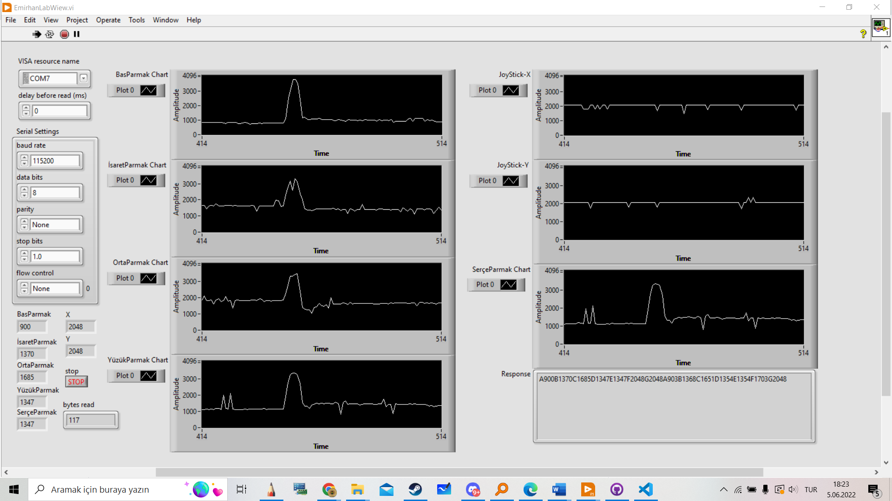
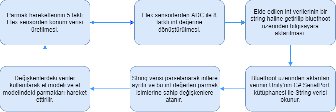
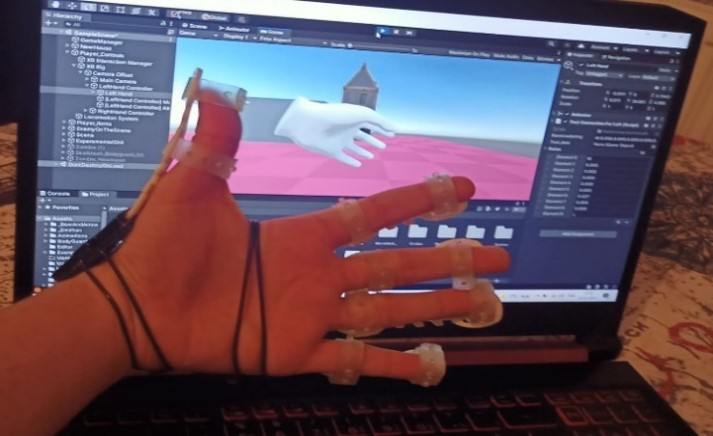
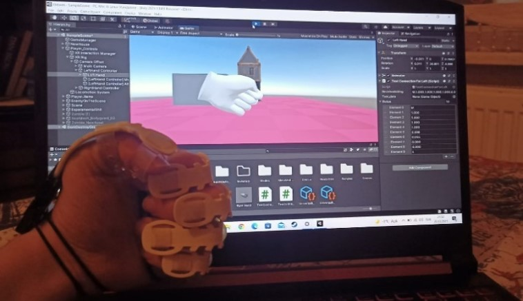

# Sanal gerçeklik uyumlu akıllı eldiven ve rehabilitasyon yazılımı geliştirilmesi
## Emirhan Süzer 170519019
## **Projenin Amacı**

Dünya üzerinde farklı sebeplerden dolayı ince motor kas hareketleri kısıtlanan ve sürekli fiziksel tedavi ve rehabilitasyon tedavisi olan milyonlarca birey bulunmakta. Ayrıca özel eğitim gereksinimi bulunan bireylerde motor ve kas rahatsızlıkları çok sık görünmekte. Bu proje asıl olarak hem tedaviye ulaşımı, tedavinin bireyler için eziyet olmaktan çıkması amacıyla ortaya çıkmıştır. El hareket zorluğu çeken bireyler için prototip akıllı eldiven referans alınarak VR gözlük ve bilgisayar ile entegre olacak yeni bir akıllı eldiven üretilecektir. Bu sayede sanal gerçeklik ortamında akıllı eldiveni kullanacak kişinin el hareketleri birebir olarak sanal ortama aktarabilecektir. Akıllı eldiven, özel eğitim ihtiyacı duyan bireylerin fizik tedavi ve rehabilitasyon uygulamalarını hızlı ve zahmetsiz sanal ortamda gerçekleştirecek. Fizyoterapistlere danışılarak hazırlanmış tedavi içerikleri ile her türlü rehabilitasyon hareketleri hastane ortamına ihtiyaç duymadan gerçekleştirilebilir hale gelecektir. 

## Projede Kullanılan Yazılımlar
* Unity
* Ardunio IDE
* Visual Stduio 
* LabWiew
* SteamVR
* OpenGloves

## LabView
 

## Eldivenin Şeması
 

## Çalışma Algoritması
 

## Kullanılan Malzemeler
* 2 x ESP32 Wifi + Bluetooth Mini Geliştirme Kart
* 2 x Delikli Plaket
* 1x40 Precision Erkek Header
* 2 x PSP 2000 Joystick Analog
* 10 x Flex Sensör 
* Flex Filement
* PLA Filement

## Eldivenin Çalışırkenki Hali

